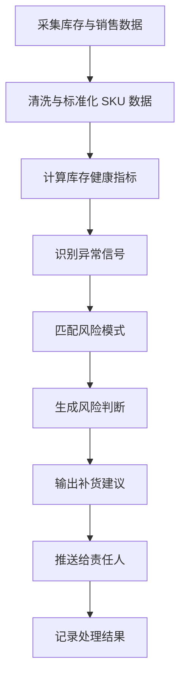

# 补雀（BuQue）

**早一步预警，少一次缺货。**

补雀（BuQue）是一个面向跨境电商卖家的库存风险监控与补货建议系统。

它持续观察多平台、多店铺、多仓库、多 SKU 的库存信号，提前发现断货、滞销、异常波动、补货延迟和库存责任不清等问题，并给出可执行的补货建议。

补雀不是一个普通库存看板，而是一个“库存金丝雀”：在风险真正变成损失之前，先发出信号。

---

## 为什么叫补雀？

**补雀 = 补货 + 金丝雀 + 不缺。**

在跨境电商库存管理中，风险通常不是突然发生的。

断货之前，往往已经出现了销售速度异常、可售天数下降、在途库存不足、补货提前期过长等信号。

滞销之前，也往往已经出现了周转放缓、库存积压、广告转化下降、仓储压力上升等信号。

补雀的目标，就是像金丝雀一样，提前感知这些微弱变化，并把它们转化为清晰的风险判断和补货动作。

> 库存要不要补，补雀先知道。

---

## 产品定位

补雀是一个跨境电商库存风险 Agent。

它关注的不是“现在库存还有多少”，而是：

* 这个 SKU 会不会断货？
* 这个 SKU 是否已经出现滞销风险？
* 当前库存能支撑多少天？
* 是否需要补货？
* 应该补多少？
* 为什么系统给出这个建议？
* 这个 SKU 的备货责任应该由谁处理？
* 哪些异常需要运营、采购、仓库或负责人介入？

补雀的核心定位是：

> 从库存数据中发现风险，从风险信号中形成建议，从建议中推动补货动作。

---

## 核心能力

### 1. SKU 库存监控

补雀会持续监控每个 SKU 的库存状态，包括：

* 当前可售库存
* 在途库存
* 安全库存
* 可售天数
* 日均销量
* 销售速度变化
* 库存周转
* 仓库分布
* 平台库存状态
* 采购与补货记录

系统会将这些数据转化为库存健康信号。

---

### 2. 风险预警

补雀会识别常见库存风险，包括：

* 即将断货
* 已经断货
* 可售天数不足
* 补货来不及
* 销量突增导致库存失衡
* 销量下降导致库存积压
* 在途库存异常
* 仓库库存不均衡
* SKU 长期无动销
* 库存责任人未处理
* 补货建议被长期忽略

每一个风险都会被标记为不同等级：

| 风险等级     | 含义          |
| -------- | ----------- |
| Low      | 轻微异常，需要观察   |
| Medium   | 存在风险，需要关注   |
| High     | 明确风险，需要处理   |
| Critical | 严重风险，需要立即行动 |

---

### 3. 补货建议

补雀不仅提示风险，还会输出补货建议。

建议内容包括：

* 是否需要补货
* 建议补货数量
* 建议补货时间
* 建议补货仓库
* 预计可售天数
* 预计断货时间
* 当前建议依据
* 风险解释
* 责任人建议

示例：

```text
SKU：A-BLACK-M
风险等级：High

判断：
当前可售库存仅剩 8 天，供应商平均交期为 15 天，在途库存不足以覆盖销售需求。

建议：
建议在 2 天内发起补货，建议补货数量为 320 件。

原因：
近 7 日销量较近 30 日均值提升 42%，当前库存消耗速度明显加快。
若不补货，预计将在 8 天后断货。
```

---

## 使用场景

### 场景一：运营日常巡检

运营每天打开补雀，查看所有 SKU 的库存风险状态。

补雀会自动将 SKU 分为：

* 需要立即处理
* 需要观察
* 暂无风险
* 数据不足
* 责任待确认

运营不需要从大量表格中人工筛选异常，而是直接处理系统识别出的风险 SKU。

---

### 场景二：断货提前预警

当某个 SKU 的销售速度突然上升，而当前库存和在途库存无法覆盖交期时，补雀会提前预警。

系统会说明：

* 为什么它认为会断货
* 预计什么时候断货
* 是否还有在途库存
* 现有库存能支撑多久
* 现在补货是否来得及
* 建议补多少

---

### 场景三：滞销风险发现

当某个 SKU 长期库存偏高，但销量持续下降时，补雀会提示滞销风险。

系统会说明：

* 当前库存是否过高
* 周转是否变慢
* 是否超过安全库存上限
* 是否需要暂停补货
* 是否需要促销、清仓或转仓

---

### 场景四：多仓库存协同

对于存在多个仓库、多个平台、多个国家站点的 SKU，补雀会分析库存分布是否合理。

系统会识别：

* 某仓库存不足
* 某仓库存积压
* FBA 与海外仓库存不平衡
* 可售库存与在途库存不匹配
* 仓库之间是否需要调拨

---

### 场景五：备货责任管理

补雀支持不同 SKU 的备货责任模式。

常见责任模式包括：

| 模式  | 含义           |
| --- | ------------ |
| 主导型 | 单一负责人主导备货决策  |
| 联合型 | 运营、采购、仓库共同决策 |
| 分散型 | 多角色分别负责不同环节  |

补雀会根据责任模式，决定风险应该推送给谁、由谁确认、由谁执行、由谁跟进。

---

## 工作流程

补雀的运行流程如下：



---

## 核心模块

### Data Collector

负责采集跨境电商业务中的关键数据。

数据来源可以包括：

* ERP
* Amazon Seller Central
* Shopify
* 独立站后台
* WMS
* 采购表格
* 运营手工表
* RPA 抓取结果

---

### SKU Profile

负责维护 SKU 的基础信息。

包括：

* SKU 编码
* 产品名称
* 平台
* 店铺
* 仓库
* 供应商
* 采购交期
* 安全库存
* 责任人
* 备货模式
* 销售状态

---

### Signal Engine

负责将原始数据转化为可判断的库存信号。

常见信号包括：

* sales_velocity_up
* sales_velocity_down
* days_of_supply_low
* inventory_overstock
* inbound_stock_missing
* reorder_delay
* stockout_risk
* stagnant_inventory
* warehouse_imbalance

---

### Pattern Engine

负责识别库存风险模式。

示例：

| Pattern                | 含义         |
| ---------------------- | ---------- |
| Fast Sell-through Risk | 销量加速导致断货风险 |
| Slow Moving Overstock  | 动销放缓导致积压风险 |
| Lead Time Gap          | 交期覆盖不足     |
| Inbound Mismatch       | 在途库存与需求不匹配 |
| Warehouse Imbalance    | 仓库库存分布失衡   |
| Responsibility Delay   | 风险责任人未及时处理 |

---

### Replenishment Advisor

负责生成补货建议。

它会综合考虑：

* 当前库存
* 日均销量
* 销售趋势
* 采购交期
* 安全库存
* 在途库存
* 目标覆盖天数
* 仓库限制
* 责任模式
* 历史补货记录

输出结果包括：

* 建议是否补货
* 建议补货数量
* 建议补货时间
* 建议操作人
* 建议优先级
* 风险解释

---

### Alert Center

负责推送和管理风险提醒。

提醒方式可以包括：

* Web 控制台
* 邮件
* 企业微信
* 飞书
* Slack
* 每日库存风险日报

---

## 示例输出

### SKU 风险摘要

```json
{
  "sku": "CASE-IP15-BLACK",
  "risk_level": "High",
  "risk_type": "stockout_risk",
  "days_of_supply": 7,
  "lead_time_days": 15,
  "suggested_reorder_quantity": 500,
  "suggested_action": "replenish_now",
  "reason": "当前可售库存无法覆盖供应商交期，近 7 日销量高于近 30 日均值。",
  "owner": "运营负责人"
}
```

### 补货建议摘要

```text
建议立即补货。

当前 SKU 可售库存预计仅能支撑 7 天，但供应商平均交期为 15 天。
若不补货，预计将在交期完成前出现断货。
建议本次补货 500 件，并优先补充至美国海外仓。
```

---

## 产品边界

补雀关注库存风险判断与补货建议，不直接替代 ERP、WMS 或财务系统。

它更适合作为现有系统之上的智能监控层：

```text
ERP / WMS / 平台后台 / 表格 / RPA
              ↓
          补雀 BuQue
              ↓
库存风险识别 / 异常归因 / 补货建议 / 责任推送
```

补雀不负责：

* 订单履约
* 仓库实际拣货
* 财务核算
* 供应商付款
* 平台商品上架
* 广告投放执行

补雀负责：

* 看见风险
* 解释风险
* 建议动作
* 推动责任人处理

---

## Roadmap

### Phase 1：库存风险看板

* SKU 基础数据接入
* 库存健康指标计算
* 断货风险识别
* 滞销风险识别
* 风险等级展示
* 每日风险列表

### Phase 2：补货建议

* 安全库存配置
* 采购交期配置
* 日均销量计算
* 建议补货数量
* 建议补货时间
* 补货优先级排序

### Phase 3：责任制协同

* SKU 责任人配置
* 主导型 / 联合型 / 分散型备货模式
* 风险分派
* 处理状态追踪
* 超时提醒

### Phase 4：Agent 化分析

* 自动解释异常原因
* 自动生成 SKU 风险日报
* 自动发现新风险模式
* 自动提出 Pattern 优化建议
* 支持人审后沉淀为规则

---

## 命名系统

### 产品名

```text
补雀 BuQue
```

### 主 slogan

```text
早一步预警，少一次缺货。
```

### 副 slogan

```text
库存要不要补，补雀先知道。
```

### 英文描述

```text
BuQue is an inventory risk monitor and replenishment advisor for cross-border sellers.
```

### 中文描述

```text
补雀是面向跨境卖家的库存风险预警与补货建议系统。
```

---

## 适合谁使用？

补雀适合以下团队：

* Amazon 卖家
* Shopify 独立站卖家
* 多平台跨境电商团队
* 有海外仓或 FBA 库存的团队
* SKU 数量较多的运营团队
* 需要降低断货和积压风险的供应链团队
* 依赖表格、ERP、RPA 管理库存但缺少主动预警的团队

---

## 设计原则

补雀遵循以下设计原则：

### 1. 先发现风险，再解释原因

系统不只展示数据，而要判断哪些数据意味着风险。

### 2. 先给建议，再让人确认

补雀不替代人做最终决策，但要把可执行建议推到人面前。

### 3. 先覆盖核心 SKU，再扩展全部 SKU

优先监控高销量、高价值、高风险 SKU。

### 4. 先规则闭环，再 Agent 增强

早期使用稳定规则识别核心风险，后续逐步引入 Agent 做归因、总结和模式发现。

### 5. 先形成责任闭环，再追求自动化

库存风险必须有人接收、确认、处理和复盘。

---

## 当前状态

补雀仍处于早期产品设计与原型验证阶段。

当前重点：

* 明确 SKU 风险监控指标
* 设计补货建议逻辑
* 建立风险 Pattern 体系
* 梳理备货责任模型
* 打通最小可用数据链路
* 完成第一个可运行的库存风险 Agent

---

## License

TBD

---

## About

补雀 BuQue
早一步预警，少一次缺货。

让库存风险先出声。
