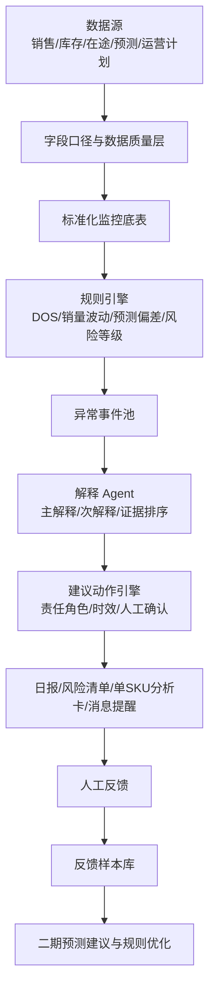

# 补雀（BuQue）

**早一步预警，少一次缺货。**

补雀（BuQue）是面向跨境电商计划、运营、采购与仓储协同团队的 **库存与销量监控预警 Agent**。

它的核心目标不是替代人拍板，而是把分散在 ERP、WMS、销售系统、预测表、运营计划表和人工 Excel 里的库存信号统一起来，持续识别断货、滞销、销量异常、预测偏差与数据异常，并输出可解释、可追溯、可人工确认的建议动作。

> 补雀不是一个普通库存看板，而是站在业务链路上的“库存金丝雀”：在风险真正变成损失之前，先发出信号。

---

## 为什么叫补雀？

**补雀 = 补货 + 金丝雀 + 不缺。**

跨境电商库存风险通常不是突然发生的。

断货之前，往往已经出现 DOS 下降、销量突升、在途延期、预测未同步、重点链接库存消耗过快等信号。

滞销之前，也往往已经出现 DOS 过高、动销持续变弱、库龄拉长、季节窗口变化、链接流量衰减、计划补货偏多等信号。

补雀的作用，就是提前感知这些信号，并把它们转化为清晰的风险判断、解释依据、建议动作和责任闭环。

> 库存要不要补，补雀先知道。

---

## 项目定位

补雀定位为 **Planning Monitor & Inventory Risk Alert Agent**。

它位于现有业务系统之上，不替代 ERP、WMS、采购系统或运营系统，而是作为一个智能监控与解释层：

```text
ERP / WMS / 销售系统 / 预测表 / 运营计划 / RPA 抓取结果
                         ↓
                    补雀 BuQue
                         ↓
    风险识别 / 异常解释 / 建议动作 / 责任分发 / 人工反馈
```

补雀要回答的不是“库存还有多少”，而是：

- 哪些 SKU 今天最需要关注？
- 哪些 SKU 有断货风险？
- 哪些 SKU 正在滞销或积压？
- 哪些销量波动是真异常，哪些只是运营动作？
- 当前预测是否明显偏离实际？
- 这个风险为什么出现？
- 应该由谁确认？
- 需要观察、催交、补货、调拨、控量、去化，还是先修数据？
- 人工最终采纳了什么？为什么采纳或驳回？

---

## 核心能力

补雀按六层能力建设，而不是只围绕一期功能描述。

| 能力层 | 说明 | 当前阶段重点 |
|---|---|---|
| Monitor 监控 | 接入销量、库存、在途等数据，形成每日监控底表（预测一期可选） | 一期 P0 |
| Alert 预警 | 基于规则识别断货、滞销、销量异常、数据异常（预测偏差一期默认关闭） | 一期 P0 |
| Explain 解释 | 对异常 SKU 输出主解释、次解释、关键证据和冲突处理原则 | 一期阶段 2 必交付 |
| Advise 建议 | 给出建议动作、责任角色、时效要求和人工确认项 | 一期阶段 2 必交付 |
| Workflow 闭环 | 记录人工采纳、驳回、修正原因和最终动作 | 一期 P1 / 二期基础 |
| Learn 学习 | 基于反馈样本辅助预测修正与规则优化，但不自动拍板 | 二期及以后 |

---

## 项目边界

### Agent 可以做

- 自动读取和标准化业务数据
- 复刻并执行已确认的 Excel 监控规则
- 计算 DOS、销量波动、预测偏差、库存风险等级等指标
- 识别异常 SKU 并生成风险清单
- 根据证据输出异常解释
- 生成建议动作和责任角色
- 输出日报、清单页、单 SKU 分析卡
- 记录人工反馈，用于复盘与二期预测建议

### Agent 不可以做

- 不自动修改正式预测
- 不自动生成采购单
- 不自动触发调拨
- 不自动降价、清货或调整促销
- 不自行修改规则阈值
- 不在数据异常未排除前输出强业务结论
- 不替代计划主管、运营主管、采购或管理层拍板

---

## 一句话架构

补雀采用 **规则引擎 + 解释 Agent + 人工反馈闭环** 的结构。



详细架构见：[docs/03_ARCHITECTURE.md](docs/03_ARCHITECTURE.md)

---

## 风险类型

一期重点识别五类风险，后续可扩展更多供应链和经营风险。

| 风险类型 | 识别目标 | 典型信号 |
|---|---|---|
| 断货风险 | 判断库存是否无法覆盖未来销售与交期 | DOS 低、销量突升、在途延期、重点链接库存消耗过快 |
| 滞销风险 | 判断库存是否过高或动销变弱 | DOS 高、近 30/60/90 天销量低、库龄拉长、季节尾声 |
| 销量异常 | 判断近期销量是否偏离正常节奏 | 近 3 天 / 近 15 天 / 近 30 天销量比率异常 |
| 预测偏差 | 判断预测是否未同步实际变化（一期默认关闭，预测接入后启用） | 实际销量与预测差距扩大、运营计划未进入预测 |
| 数据异常 | 判断是否存在字段缺失或口径冲突 | 负库存、ETA 缺失、重复 SKU、字段过期、映射错误 |

详细规则与输出标准见：[docs/05_RULES_AND_OUTPUTS.md](docs/05_RULES_AND_OUTPUTS.md)

---

## 文档结构

本项目采用「CONTEXT + README + 嵌套专题文档」结构：领域决议在根目录，产品与实现细节在 `docs/`。

| 文档 | 用途 |
|---|---|
| [**CONTEXT.md**](CONTEXT.md) | **领域术语、关系、一期决议、默认配置（开发优先读）** |
| [README.md](README.md) | 项目总览、定位、能力、边界、文档入口 |
| [docs/00_DOCUMENT_MAP.md](docs/00_DOCUMENT_MAP.md) | 文档地图、SSOT、开发阅读顺序 |
| [docs/01_PROJECT_CHARTER.md](docs/01_PROJECT_CHARTER.md) | 项目章程：目标、角色、边界、收益、成功标准 |
| [docs/02_ROADMAP.md](docs/02_ROADMAP.md) | 产品级路线图：从一期规则复制到二期预测建议，再到长期 Agent 化 |
| [docs/03_ARCHITECTURE.md](docs/03_ARCHITECTURE.md) | 系统架构、核心模块、数据链路、表结构建议 |
| [docs/04_IMPLEMENTATION_PLAN.md](docs/04_IMPLEMENTATION_PLAN.md) | 一期落地计划、工作流、里程碑、**开发启动清单** |
| [docs/05_RULES_AND_OUTPUTS.md](docs/05_RULES_AND_OUTPUTS.md) | 风险规则、解释规则、输出模板、反馈模板 |
| [docs/06_GOVERNANCE.md](docs/06_GOVERNANCE.md) | 字段、规则、权限、安全、变更、人工确认机制 |
| [docs/adr/](docs/adr/) | 难逆转架构决策记录 |

---

## 开发入口

一期 Grill 已收口，可直接按 [`docs/04_IMPLEMENTATION_PLAN.md` §9](docs/04_IMPLEMENTATION_PLAN.md) 开工：

1. 读 [`CONTEXT.md`](CONTEXT.md) 对齐术语与默认配置  
2. M1 向业务索取重点 SKU / 仓清单与 Excel 对照样例  
3. 按 P0 数据接入 → 规则引擎 → 解释日报 → 反馈 顺序实现  

---

## Roadmap 摘要

补雀的建设不应被一期限制。一期是最小可信闭环，长期目标是形成计划监控、异常解释、补货建议和预测辅助的一体化 Agent。

| 阶段 | 名称 | 目标 |
|---|---|---|
| Phase 0 | 对齐与口径冻结 | 固定字段、规则、参数、输出、验收标准 |
| Phase 1 | 规则复制与监控底座 | 把现有 Excel 监控逻辑稳定搬进系统 |
| Phase 2 | 异常解释与日报 | 让 Agent 对异常 SKU 输出解释、建议和日报 |
| Phase 3 | 人工反馈闭环 | 沉淀采纳、驳回、修正原因和最终动作 |
| Phase 4 | 预测建议 | 基于反馈样本辅助预测修正，但仍由人工确认 |
| Phase 5 | 发现型 Agent | 自动发现新风险模式，提交给人审后沉淀为规则 |

完整路线图见：[docs/02_ROADMAP.md](docs/02_ROADMAP.md)

---

## 当前落地重点

当前阶段建议聚焦：

1. **先复制现有 Excel 规则，不先重构业务逻辑**
2. **先跑重点 SKU / 重点仓 / 重点类目，不先追求全量复杂覆盖**
3. **先保证规则一致率和数据口径稳定，再引入更复杂 AI 判断**
4. **AI 先做解释与建议，不改预测、不改阈值、不执行采购调拨**
5. **必须做人工反馈记录，为二期预测建议积累样本**

---

## 核心验收指标

| 指标类别 | 指标 | 建议目标 |
|---|---|---|
| 规则一致性 | 系统结果与现有 Excel 结果一致率 | ≥95% |
| 风险有效性 | 红橙灯经人工确认有处理价值的比例 | 建议 ≥70% |
| 误报控制 | 被人工判定无效的异常比例 | 持续下降 |
| 监控时效 | 每日固定时间前产出日报 | 按业务约定 |
| 人工提效 | 单日盯表与初筛耗时下降 | 建议 50%+ |
| 业务采纳 | Agent 建议被采纳或部分采纳比例 | 建议 ≥50% |
| 系统稳定性 | 定时任务成功率 | ≥99% |

---

## 安全原则

- README 与代码库不得写入账号、密码、Cookie、Token、数据库连接串。
- 只读账号、RPA 账号、接口密钥必须进入环境变量或 Secret 管理。
- 规则参数必须配置化，并保留版本号、生效日期、提出人、审批人和变更原因。
- Agent 输出必须保留输入字段、触发规则、解释版本和人工反馈。
- 红灯、预测建议、采购、调拨、清货等高风险动作必须人工确认。

详细治理规范见：[docs/06_GOVERNANCE.md](docs/06_GOVERNANCE.md)

---

## 品牌口径

**补雀 BuQue**  
**早一步预警，少一次缺货。**

短版介绍：

> 补雀是面向跨境电商计划团队的库存与销量监控预警 Agent，帮助团队每日自动识别断货、滞销、销量异常和预测偏差，并输出解释、建议和人工确认项。

内部对齐口径：

> 先复制现有 Excel 规则，再做异常解释与反馈闭环；一期只做监控预警和建议，不自动拍板。

英文描述：

> BuQue is a planning monitor and inventory risk alert Agent for cross-border ecommerce teams. It detects stockout risk, slow-moving inventory, sales anomalies, forecast bias, and data issues, then generates explanations, recommended actions, and human confirmation tasks.

---

## License

TBD
