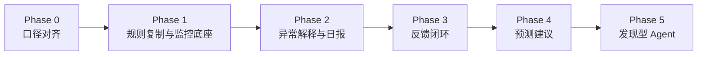

# Roadmap：补雀 BuQue 产品路线图

本文档同时解决两个问题：

1. 项目长期应该往哪里走。
2. 当前一期应该如何落地，且不被一期边界限制整体设计。

> **说明**：下文 **Phase 0–5** 描述产品长期能力建设顺序；**一期交付**（对齐包）在「一期落地路线」三阶段内完成（规则跑通 → 解释与日报 → 反馈闭环），不与 Phase 2/3 编号一一对应。预测建议属二期（落地路线阶段 4）。

---

## 总体路线

---

## Phase 0：口径对齐

### 目标

冻结项目的基本口径，避免开发过程中反复变更。

### 关键任务

- 明确字段定义、来源系统、刷新频率和质量要求
- 明确断货、滞销、销量异常、预测偏差、数据异常的规则口径
- 明确红、橙、黄、绿风险等级
- 明确输出模板：日报、风险清单、单 SKU 分析卡、人工反馈
- 明确一期范围和不做项
- 明确验收指标

### 退出条件

- 字段口径已确认
- 规则参数表已确认
- 输出模板已确认
- 一期验收指标已确认
- 关键账号和数据源接入方式已明确，但不写入仓库

---

## Phase 1：规则复制与监控底座

### 目标

把当前人工 Excel 监控逻辑稳定搬进系统。

### 建设重点

- 数据抽取
- 数据清洗
- 标准化监控底表
- 规则引擎
- 风险等级计算
- 与现有 Excel 结果一致率验证

### 一期重点

这是当前项目的最小可信闭环。它不追求一开始就“智能”，而是先确保系统能稳定复刻业务已认可的监控逻辑。**解释与日报在一期阶段 2 必交付**（见「一期落地路线」），不属于二期范围。

### 交付物

- 标准化监控底表
- 字段校验脚本
- 规则计算程序
- 风险标记表
- 规则一致率比对报告

### 验收标准

- Excel 规则一致率 ≥95%
- 关键字段口径可追溯
- 数据异常可被拦截
- 运行日志可排查

---

## Phase 2：异常解释与日报

### 目标

让 Agent 不只输出风险等级，还能解释为什么异常、建议怎么处理。

### 建设重点

- 异常事件池
- 解释规则表
- 解释选项库
- Agent 提示词模板
- 单 SKU 分析卡
- 日报总览
- 红橙灯提醒

### 交付物

- 每日风险总览
- 风险 SKU 清单
- 单 SKU 异常分析卡
- 红橙灯消息提醒
- 标准解释选项库

### 验收标准

- 业务认为日报“可用”
- 异常解释不乱编
- 建议动作包含理由、责任角色、时效要求
- 数据异常未排除前不输出强业务结论

---

## Phase 3：反馈闭环

### 目标

把人工处理结果沉淀为结构化样本。

### 建设重点

- 采纳 / 驳回 / 部分采纳
- 人工最终结论
- 人工修正原因标签
- 责任人处理状态
- 处理时效记录
- 复盘报表

### 交付物

- 人工反馈表
- 修正原因标签库
- 采纳率与误报率统计
- 试运行复盘报告

### 验收标准

- 人工反馈机制跑通
- 计划和运营愿意持续填写
- 反馈数据可用于二期预测建议
- 误报率可持续下降

---

## Phase 4：预测建议

### 目标

让 Agent 基于历史反馈辅助预测修正，但仍由人工确认。

### 前置条件

- 已沉淀“基础预测 → 人工修正 → 最终确认 → 实际销量”链路
- 人工修正原因标签已标准化
- 运营活动、促销、广告计划可结构化接入
- 缺货、活动、补货回补等异常销量可识别
- 一期规则结果和反馈质量稳定

### 建设重点

- 建议预测值
- 预测修正理由
- 预测偏差分析
- 人工确认机制
- MAPE 等预测指标评估

### 重要边界

预测建议不等于自动改正式预测。

正式预测必须由计划专员或计划主管确认后生效。

---

## Phase 5：发现型 Agent

### 目标

让 Agent 不只是执行已有规则，而是能发现新风险模式并提交人工审核。

### 能力方向

- 发现新的异常组合
- 发现现有阈值盲区
- 提出新 Pattern 候选
- 总结被人工频繁驳回的原因
- 提醒某类 SKU 需要独立阈值
- 生成人审候选规则，不自动上线

### 边界

Agent 只能提出新规则候选，不能自行修改生产规则。

---

## 一期落地路线

结合当前对齐包，推荐一期按四步推进：

| 阶段 | 周期建议 | 目标 | 范围 | 关键输出 | 通过标准 |
|---|---:|---|---|---|---|
| 阶段 1：规则跑通 | 1~2 周 | 打通数据与规则结果 | 重点 SKU / 单仓或单类目 | 监控结果与 Excel 对齐 | 规则一致率达标 |
| 阶段 2：解释与日报 | 1~2 周 | 补足解释与建议 | 重点 SKU / 重点仓 | 日报、清单、提醒 | 业务认为可用 |
| 阶段 3：反馈闭环 | 1 周+持续 | 积累采纳 / 驳回样本 | 一期范围内 | 反馈记录库 | 反馈机制跑通 |
| 阶段 4：预测建议 | 二期 | 辅助修正预测 | 成熟范围 | 建议预测值 | MAPE 等指标改善 |

---

## 不建议一期强上的内容

| 内容 | 原因 |
|---|---|
| 自动修改正式预测 | 需要先建立信任和反馈样本 |
| 自动采购 / 调拨 / 清货 | 高风险动作必须人工审批 |
| 模型自学习阈值 | 会破坏规则稳定性和可审计性 |
| 全量复杂数据源一次接入 | 容易拖慢首个闭环 |
| 预测模型重做 | 当前更重要的是先把监控、解释、反馈跑通 |

---

## 路线图判断标准

每个阶段进入下一阶段前，需要回答：

1. 当前阶段的结果是否稳定？
2. 业务是否真的使用？
3. 输出是否可追溯？
4. 人工反馈是否有记录？
5. 误报、漏报、数据异常是否能复盘？
6. 下一阶段需要的数据是否已经沉淀？

如果这些问题没有答案，不应贸然进入更复杂的 Agent 或预测阶段。
