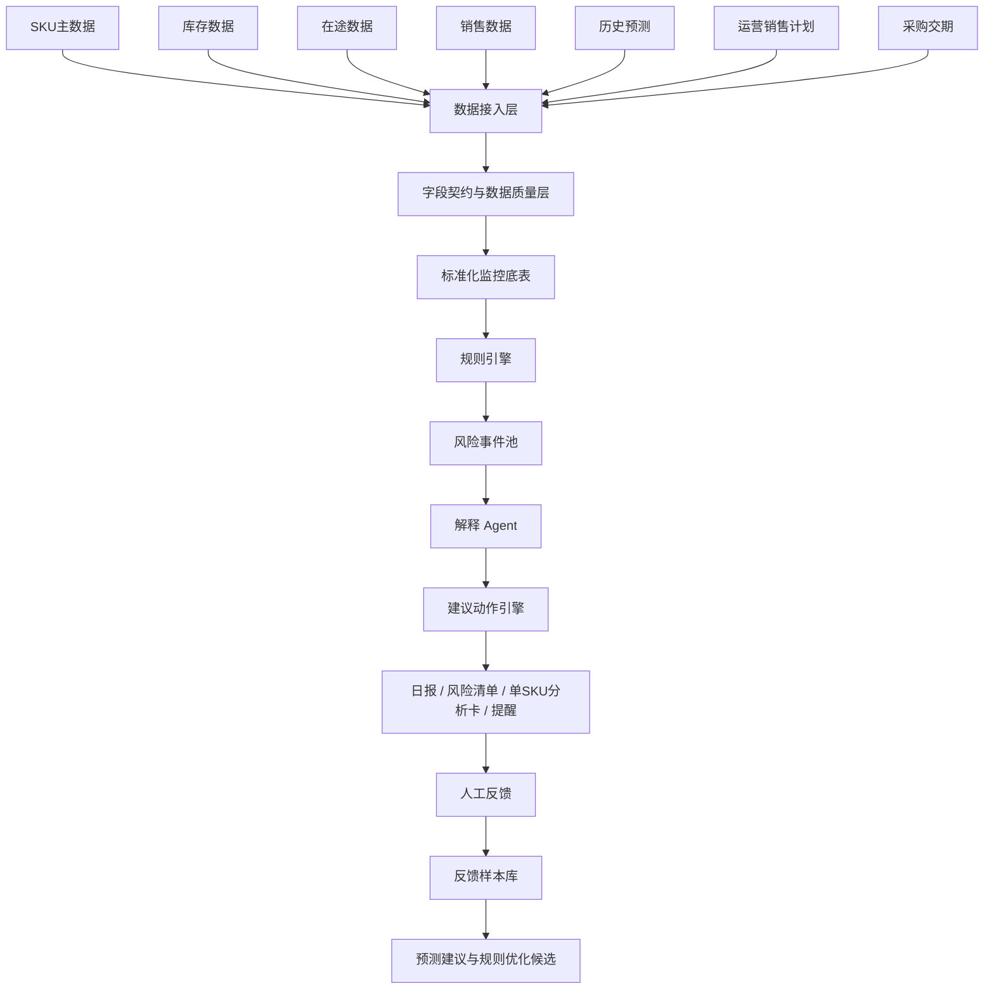

# Architecture：补雀 BuQue 系统架构

## 1. 架构原则

补雀的架构核心是：

> 规则负责稳定判断，Agent 负责解释与建议，人工反馈负责学习闭环。

系统不应让大模型直接决定所有业务动作，而应把规则、参数、字段、解释、建议、人工确认分层管理。

---

## 2. 总体链路



---

## 3. 数据接入层

一期必接或建议接入的数据源：

| 数据主题 | 关键主键 | 一期优先级 | 说明 |
|---|---|---|---|
| SKU 基础资料 | SKU | P0 | 等级、季节属性、类目、重点链接标记 |
| 库存数据 | SKU + 仓库 | P0 | 可售、锁定、不可售、仓库分布 |
| 在途数据 | SKU + 批次 + ETA | P0 | 预计到货日期、状态、延期标记 |
| 销售数据 | SKU + 日期 + 仓库/渠道 | P0 | 订单 MSKU 粒度抓取后映射；见下方 ERP 来源 |
| 产品库存（仓级） | SKU + 仓库 | P0 | ERP 产品库存页：可售、7天日均、周转；WAREHOUSE 主数据源 |
| 历史预测 | SKU + 日期 + 预测版本 | P1（一期可选） | 表结构预留；`FORECAST_BIAS_ENABLED=false` 时不参与 DOS 与风险判断 |
| 运营销售计划 | SKU + 日期/活动 ID | P1 | 若没有系统，可先标准模板导入 |
| 采购交期 | SKU + PO | P0 | 下单日、交期、延期标记 |
| 价格促销 | SKU + 日期 | P2 | 用于提高解释准确率 |
| 广告投放 | SKU/ASIN + 日期 | P2 | 用于区分自然波动与运营放量 |

### 一期 ERP / RPA 来源（P0）

| 数据 | ERP 入口 | 粒度 | 写入目标 |
|---|---|---|---|
| 订购销量 | 全渠道订单 `/sales/multiChannel/orders` | MSKU + 订购时间(市场) | `fact_sales_daily`（再映射 Basic SKU） |
| 仓级库存与日销 | 产品库存 `/gip/inventoryManage/product` | SKU × 仓库 | `fact_inventory_daily`、WAREHOUSE `ref_daily_sales` |
| 在途批次 | TMS 发货单（对齐包 RPA 规格） | SKU + 目的仓 + ETA + 状态 + 未收量 | inbound 明细表 |
| 仓内在途量（无 ETA） | 库存管理在途量字段 | SKU + 仓库 | 仅展示/校验，不参与缓释 |

时区与日期归因统一使用 **Asia/Shanghai**；市场日销量按「订购时间(市场)」归因。

---

## 4. 字段契约层

字段契约解决三个问题：

1. 字段是什么意思。
2. 字段来自哪里。
3. 字段是否足以支持风险判断。

关键字段包括：

| 分类 | 字段示例 | 作用 |
|---|---|---|
| 基础信息 | sku、msku、product_name、item_grade、seasonality、is_key_listing | 决定主键、映射、阈值和优先级 |
| 仓储库存 | warehouse、available_inventory、reserved_inventory、on_hand_inventory | 计算真实可售与仓库分布 |
| 在途采购 | in_transit_inventory、eta_date、lead_time_days | 判断在途是否来得及 |
| 销售表现 | sales_d1、sales_3d、sales_7d、sales_30d、avg_sales_7d | 判断销量波动与趋势 |
| 预测计划 | current_forecast、forecast_daily、ops_plan_adjustment、final_confirmed_forecast | 判断预测偏差与 DOS |
| 风险判断 | ref_daily_sales、dos、stockout_level、slow_moving_level | 风险判断结果 |
| 输出反馈 | agent_action、manual_decision、adopted_flag、manual_reason_tag | 建立反馈闭环 |

### 数据质量拦截

以下情况应优先输出数据异常，而不是业务结论：

- SKU 缺失或重复
- 库存为负
- 可售库存大于总库存
- 销量字段过期
- 仓库映射错误
- DOS 计算所需的库存或销量核心字段为空

以下情况**不阻断** DOS 与断货/滞销判断：

- 预测版本缺失（一期默认 `FORECAST_BIAS_ENABLED=false`）
- 无 ETA 的仓库在途量（仅展示/校验，不参与缓释）

在途参与缓释时，ETA 须可信，且 TMS 状态为**已出运**或**入库中**；**提货中**仅展示。缓释成立时允许红灯降橙灯，须输出「需关注到货兑现」。

---

## 5. 规则引擎

规则引擎负责稳定、可复核的判断。

### 输入

- 标准化监控底表
- 规则参数表
- 字段质量结果
- SKU 属性
- 业务配置

### 输出

- 风险类型
- 风险等级
- 触发规则
- 触发指标
- 是否需要解释
- 是否需要人工确认

### 规则配置原则

- 所有阈值必须配置化
- 规则必须有编码
- 参数必须有版本号
- 参数变更必须记录提出人、审批人、生效日期和原因
- Agent 不得自行修改阈值

---

## 6. 异常事件池

异常事件池是 Rule Engine 和 LLM Agent 之间的隔离层。

规则引擎只把“需要解释的异常”放入事件池，避免对所有 SKU 进行大模型分析。

事件池字段建议：

| 字段 | 说明 |
|---|---|
| event_id | 异常事件 ID |
| date | 监控日期 |
| sku | SKU |
| warehouse | 仓库 |
| risk_type | 风险类型 |
| risk_level | 风险等级 |
| trigger_rule | 触发规则编码 |
| trigger_metrics | 触发指标 |
| evidence_context | 解释需要的上下文字段 |
| require_human_confirm | 是否需人工确认 |

---

## 7. 解释 Agent

解释 Agent 不负责改规则，只负责解释异常。

### 输入

- 异常事件
- 触发指标
- 历史销量 / 库存 / 在途 / 预测
- 运营计划或活动信息
- 解释规则表
- 解释选项库

### 输出

- 主解释
- 次解释
- 第三解释
- 关键证据
- 冲突处理原则
- 建议动作
- 是否需要人工确认
- 置信度或证据充分性说明

### 解释原则

- 先识别现象，再选择候选解释
- 有直接计划证据时优先于统计推断
- 数据异常优先级高于业务解释
- 供给受限时，不直接判断需求走弱
- 缺货恢复期销量不直接外推为长期趋势
- 能解释更多联动指标的原因优先

---

## 8. 建议动作引擎

建议动作必须具体、可执行、可分发。

| 场景 | 建议动作 |
|---|---|
| 断货风险 | 观察、修正预测、确认运营计划、催交、追加采购评估、调拨评估 |
| 滞销风险 | 观察、降速补货、去化策略评估、提醒运营确认清货计划 |
| 销量异常 | 观察、人工复核、同步运营计划、标记活动影响 |
| 预测偏差 | 建议修正预测、待运营确认、暂不调整 |
| 数据异常 | 修复字段、修复映射、暂停该 SKU 风险结论 |

每条建议至少包含：

- 建议动作
- 建议理由
- 触发指标
- 责任角色
- 时效要求
- 是否必须人工确认

---

## 9. 结果发布层

结果发布层包括：

- 日报总览
- 风险 SKU 清单
- 单 SKU 异常分析卡
- 红橙灯提醒
- 人工反馈入口
- 问答入口

推荐优先级：

1. 日报总览
2. 风险清单
3. 单 SKU 分析卡
4. 红灯即时提醒
5. 橙灯日报提醒
6. 问答入口

---

## 10. 结果表建议

| 表名 | 用途 | 主键建议 |
|---|---|---|
| dim_sku | SKU 主数据 | sku |
| fact_sales_daily | 日销量事实表 | date + sku + warehouse + channel |
| fact_inventory_daily | 日库存事实表 | date + sku + warehouse |
| fact_forecast_version | 预测版本表 | date + sku + version |
| fact_monitor_result | 每日监控结果表 | date + sku + risk_type |
| fact_agent_explain | Agent 解释结果表 | date + sku + event_id |
| fact_feedback | 人工反馈表 | date + sku + handling_round |

---

## 11. 部署形态建议

一期可以先采用轻量形态：

```text
定时任务 / RPA / 数据库视图
        ↓
规则计算脚本
        ↓
结果表 / Excel / 页面
        ↓
Agent解释服务
        ↓
日报 / 消息提醒 / 人工反馈
```

后续成熟后再拆为：

- Data Service
- Rule Engine Service
- Agent Service
- Notification Service
- Feedback Service
- Admin Config Console
