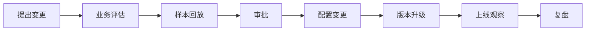

# Governance：字段、规则、权限与安全治理

## 1. 治理目标

补雀不是一次性脚本，而是会持续影响计划、运营、采购和仓储协同的业务系统。

因此必须治理以下内容：

- 字段口径
- 数据质量
- 规则参数
- 解释选项
- 权限边界
- 人工确认
- 变更记录
- 安全配置
- 运行审计

---

## 2. 字段治理

### 原则

| 原则 | 说明 |
|---|---|
| 统一口径 | 同一字段只能有一个主口径 |
| 来源唯一 | 每个字段需指定主来源系统 |
| 刷新明确 | 需说明刷新频率与时间点 |
| 可追溯 | 关键字段需追溯到原始明细 |
| 异常可拦截 | 明显错误字段不得进入业务判断 |

### 重点字段

以下字段必须优先治理：

- MSKU / Basic SKU 映射
- 当前可售库存
- 锁定库存
- 在途库存
- ETA
- 采购提前期
- 近 3/7/15/30/60/90 天销量
- 当前预测
- 预测日均销量
- 运营计划修正
- 最终确认预测
- DOS
- 断货风险等级
- 滞销风险等级
- 人工反馈字段

---

## 3. 规则治理

### 规则参数必须配置化

禁止将红、橙、黄阈值硬编码在业务代码中。

每条规则至少需要：

- 规则编码
- 规则名称
- 参数值
- 适用条件
- 系统映射字段
- 是否启用
- 版本号
- 生效日期
- 提出人
- 审批人
- 变更原因

### 规则变更流程

### 规则变更要求

- 涉及红灯或橙灯阈值的变更必须审批。
- 变更前建议做历史样本回放。
- 变更后必须记录版本号和生效日期。
- 旧版本规则应可追溯。
- Agent 不得自动修改阈值。

---

## 4. 解释选项治理

解释选项库的作用是避免 Agent 输出散乱、不可统计的自然语言。

解释选项应统一维护，例如：

- 运营放量导致
- 促销刺激导致
- 需求走弱风险
- 供给受限导致表观销量下降
- 真实断货高风险
- 短期风险可控，需关注到货兑现
- 去化持续弱
- 计划补货偏多
- 运营计划未同步到预测
- 数据异常待复核

Agent 输出可以有自然语言解释，但必须同时绑定标准化解释标签。

---

## 5. 权限边界

| 对象 | Agent 可做 | Agent 不可做 | 人工确认人 |
|---|---|---|---|
| 监控预警 | 自动识别风险并给建议 | 不可直接关闭风险 | 计划专员 / 主管 |
| 预测建议 | 输出建议预测或修正建议 | 不可覆盖正式预测 | 计划专员 / 主管 |
| 采购 / 补货 | 提示可能需补货或催交 | 不可自动下采购单 | 计划主管 / 采购 |
| 去库存动作 | 提示去化、降速补货、清货评估 | 不可自动改价或做活动 | 运营主管 |
| 规则配置 | 展示命中的阈值和规则 | 不可自改阈值 | 计划主管 / 数据负责人 |

---

## 6. 安全原则

### 禁止写入仓库

以下信息不得进入 README、docs、代码、日志或示例文件：

- 账号
- 密码
- Cookie
- Token
- 数据库连接串
- RPA 登录凭证
- 供应商后台凭证
- 云服务密钥

### 推荐方式

- 本地开发使用 `.env`
- 生产环境使用 Secret Manager
- CI/CD 使用加密变量
- RPA 只读账号单独管理
- 权限最小化
- 账号定期轮换

### README 处理原则

如果对齐包中存在只读账户 sheet，README 只能说明：

> 账号信息由项目负责人通过安全渠道提供，不进入仓库。

---

## 7. 人工确认机制

以下动作必须人工确认：

- 红灯风险关闭
- 正式预测修改
- 采购追加
- 调拨执行
- 清货 / 降价 / 促销执行
- 规则阈值调整
- 高价值 SKU 的重大判断

人工确认记录至少包括：

- 确认人
- 确认时间
- 采纳 / 驳回 / 部分采纳
- 最终动作
- 修正原因
- 备注

---

## 8. 审计与日志

系统至少记录：

- 数据读取时间
- 数据源版本
- 字段质量结果
- 规则参数版本
- 命中规则
- Agent 输入摘要
- Agent 输出版本
- 消息推送结果
- 人工反馈
- 失败重试记录

审计日志的目标不是形式化留痕，而是让团队能回答：

- 为什么这个 SKU 被标红？
- 当时用的是哪版规则？
- 哪些字段触发了判断？
- Agent 为什么给出这个解释？
- 人工为什么采纳或驳回？
- 是否发生过误报或漏报？

---

## 9. 二期学习边界

二期可以学习：

- 哪些解释更容易被采纳
- 哪些建议动作更有效
- 预测建议如何修正
- 哪些 SKU 类型需要特殊阈值候选
- 哪些异常模式经常漏报

二期不应自动学习：

- 直接修改规则阈值
- 直接修改正式预测
- 直接触发采购、调拨或清货动作
- 绕过人工审批的高风险决策

---

## 10. 项目治理会议建议

| 会议 | 频率 | 关注内容 |
|---|---|---|
| 口径评审会 | 项目初期 / 规则变更时 | 字段、规则、参数、输出 |
| 试运行复盘会 | 每周 | 命中率、误报、漏报、解释质量 |
| 规则变更会 | 按需 | 阈值变更、规则新增、规则废弃 |
| 二期规划会 | 一期稳定后 | 预测建议、反馈样本、模型边界 |
